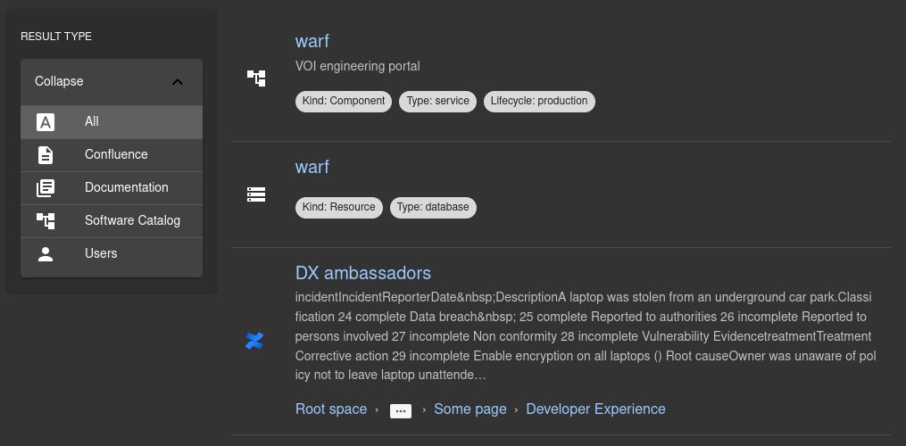

# Confluence search plugins for Backstage

This repository contains Confluence-related plugins for [Backstage](https://backstage.io/).

Current plugins:

- [`search-confluence`](./plugins/search-confluence/): frontent part of Confluence integration with Backstage search
- [`search-confluence-backend`](./plugins/search-confluence-backend/): backend part of Confluence integration with Backstage search

Installation instructions for each plugin can be found in their individual README files.

## Setup

Each plugin's README contains installation instructions.

## How does it look?

Confluence search plugin:

## Development

Add git hooks to ensure consistent formatting: `npm run prepare`.

## License

This library is under the [MIT](LICENSE) license.
