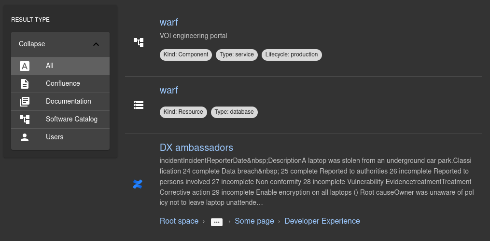

# Confluence search plugin [](https://www.npmjs.com/package/@k-phoen/backstage-plugin-confluence)

This plugin integrates Confluence documents to Backstage' search engine.

**Note:** it is used in combination with its [backend counter-part](../search-confluence-backend/).

## How does it look?

Search results:



## Installation

Add the plugin to your frontend app:

```bash
cd packages/app && yarn add @k-phoen/backstage-plugin-confluence
```

Nicely display Confluence search results:

```typescript
// packages/app/components/search/SearchPage.tsx

import { ConfluenceResultListItem } from '@k-phoen/backstage-plugin-confluence';

// ...
<SearchType.Accordion
  name="Result Type"
  defaultValue="software-catalog"
  types={[
  // ...
    {
      value: 'confluence',
      name: 'Confluence',
      icon: <DocsIcon />,
    },
  ]}
/>

<SearchResult>
  {({ results }) => (
    <List>
      {results.map(({ type, document, highlight, rank }) => {
        switch (type) {
          case 'confluence':
            return (
              <ConfluenceResultListItem
                key={document.location}
                result={document}
                highlight={highlight}
                rank={rank}
              />
            );
          // ...
        }
      })}
    </List>
  )}
</SearchResult>
```

## License

This library is under the [MIT](../LICENSE) license.
